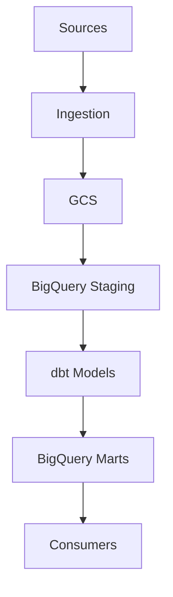

## Data Pipeline Architecture (minimal reset)

Paste ONLY the lines between the fences into Mermaid Live, not the backticks.

To view this diagram:
- Open `docs/architecture_diagram.md` in Cursor (it should render Mermaid).
- Or paste the code block into the Mermaid Live Editor (`https://mermaid.live`).
