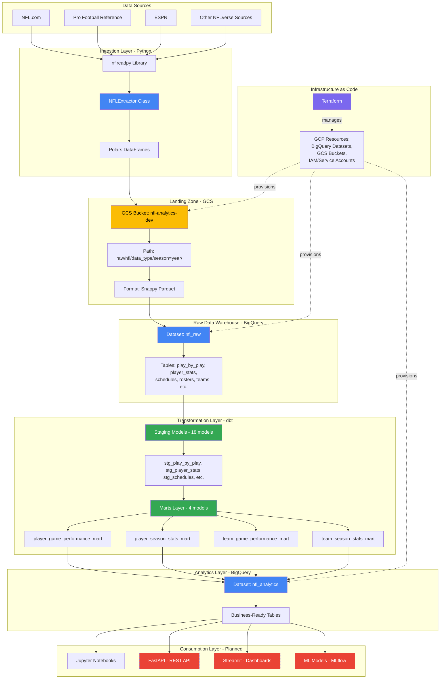
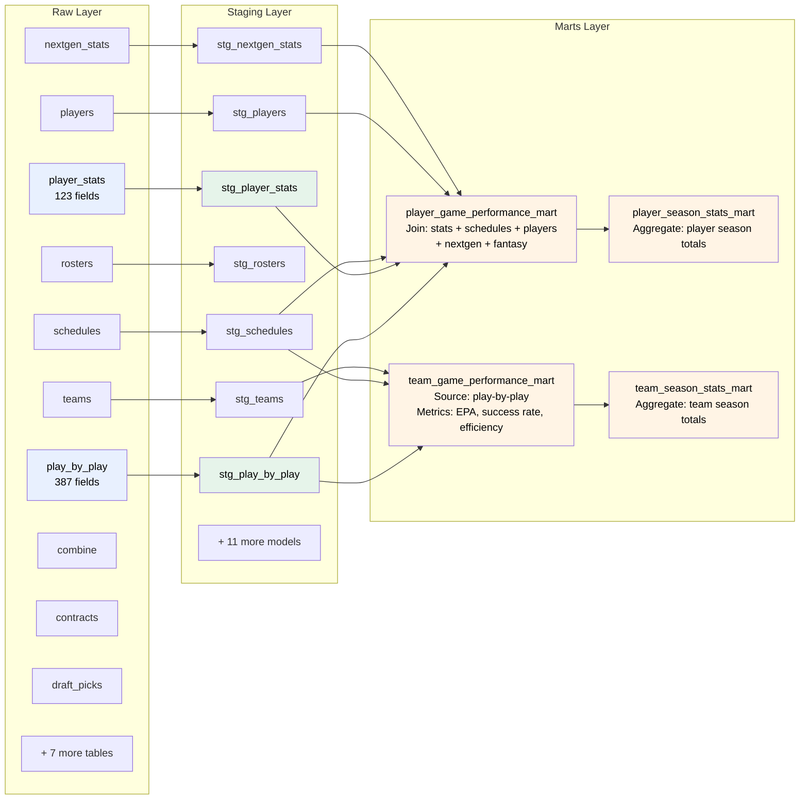
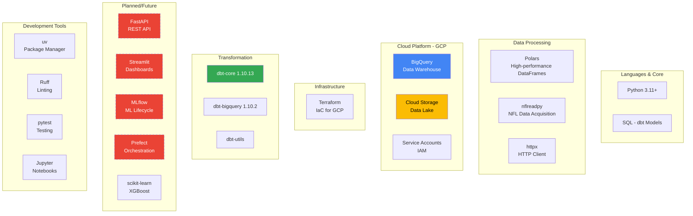
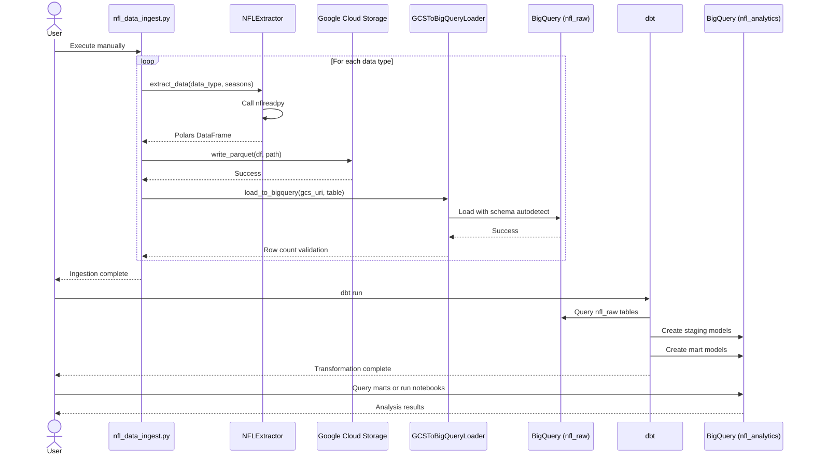

# NFL Analytics Platform - Architecture Diagram

## System Architecture Overview

## Detailed Data Flow

```mermaid
flowchart LR
    subgraph "1. Extraction"
        A[nfl_data_ingest.py<br/>Script Execution]
        B[NFLExtractor<br/>20+ Data Types<br/>Seasons 2020-2025]
    end

    subgraph "2. Storage"
        C[GCSWriter<br/>Upload Parquet]
        D[GCS Bucket<br/>Timestamped Files<br/>Lifecycle: 90d → COLDLINE]
    end

    subgraph "3. Loading"
        E[GCSToBigQueryLoader<br/>Schema Autodetection<br/>WRITE_TRUNCATE]
        F[BigQuery nfl_raw<br/>17+ Raw Tables]
    end

    subgraph "4. Transformation"
        G[dbt run<br/>Staging Layer]
        H[dbt run<br/>Marts Layer]
    end

    subgraph "5. Analytics"
        I[BigQuery nfl_analytics<br/>Marts Tables]
        J[Direct SQL Queries<br/>Jupyter Analysis<br/>Future: API/Dashboards]
    end

    A --> B
    B --> C
    C --> D
    D --> E
    E --> F
    F --> G
    G --> H
    H --> I
    I --> J

    style A fill:#4285F4,color:#fff
    style D fill:#FBBC04,color:#000
    style F fill:#4285F4,color:#fff
    style G fill:#34A853,color:#fff
    style H fill:#34A853,color:#fff
    style I fill:#4285F4,color:#fff
```

## Data Model Layers

## Technology Stack

## Data Types Ingested

### Core Game Data
- **play_by_play** - Play-level data with EPA, WPA metrics
- **schedules** - Game schedules and results

### Player & Roster Data
- **rosters** - Season-level rosters
- **rosters_weekly** - Week-by-week roster changes
- **players** - Player biographical data
- **depth_charts** - Position depth
- **injuries** - Injury reports
- **trades** - Player trades

### Performance Data
- **player_stats** - Offensive/defensive/special teams stats
- **snap_counts** - Playing time metrics
- **nextgen_stats** - Advanced tracking metrics
- **participation** - Player participation data

### League Context Data
- **officials** - Referee assignments
- **combine** - Pre-draft measurements
- **draft_picks** - Draft history
- **contracts** - Player contracts

### Fantasy Football Data
- **ff_player_ids** - Fantasy platform mapping
- **ff_opportunity** - Fantasy opportunity metrics
- **ff_rankings** - Fantasy rankings

### Teams Data
- **teams** - Franchise information

## Execution Workflow

## Key Design Patterns

### ELT (Extract, Load, Transform)
- Extract data from sources via nflreadpy
- Load raw data to GCS and BigQuery
- Transform data using dbt SQL models in BigQuery

### Layered Architecture
1. **Raw Layer** - Immutable source data
2. **Staging Layer** - Cleaned and standardized
3. **Marts Layer** - Business logic and aggregations
4. **ML Layer** - Feature engineering (planned)

### Data Quality & Governance
- **Immutability** - GCS serves as immutable data lake
- **Versioning** - GCS versioning enabled
- **Lineage** - dbt tracks data lineage through refs
- **Idempotency** - Full refresh strategy (reproducible)

### Infrastructure Management
- **Infrastructure as Code** - Terraform manages all GCP resources
- **Environment Separation** - Dev/prod via Terraform variables
- **Security** - Service accounts with minimal permissions
- **Cost Optimization** - Lifecycle policies (90d → COLDLINE)

## Current State & Roadmap

### ✅ Implemented
- Data ingestion from 20+ NFL data sources
- GCS data lake with Parquet storage
- BigQuery raw data warehouse
- dbt staging models (18 models)
- dbt mart models (4 models)
- Terraform infrastructure provisioning
- Player and team performance analytics

### 🚧 Planned/In Progress
- Incremental loading (currently full refresh only)
- Workflow orchestration with Prefect
- Data quality tests in dbt
- FastAPI REST API layer
- Streamlit dashboards
- ML models with MLflow
- CI/CD pipeline
- Enhanced error handling and monitoring

## File References

### Key Configuration Files
- `ingestion/config.py` - Ingestion settings
- `dbt_project/dbt_project.yml` - dbt configuration
- `dbt_project/profiles.yml` - BigQuery connection
- `.env` - Environment variables
- `pyproject.toml` - Python dependencies

### Main Scripts
- `scripts/nfl_data_ingest.py` - Main ingestion script
- `ingestion/nfl/extractor.py` - NFLExtractor class
- `ingestion/writers/gcs_writer.py` - GCS writer
- `ingestion/loaders/gcs_to_bigquery.py` - BigQuery loader

### dbt Models
- `dbt_project/models/staging/nfl/*.sql` - Staging models (18)
- `dbt_project/models/marts/nfl/*.sql` - Mart models (4)
- `dbt_project/models/staging/nfl/sources.yml` - Source definitions

### Infrastructure
- `infrastructure/terraform/*.tf` - Terraform configurations
