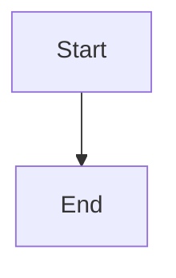
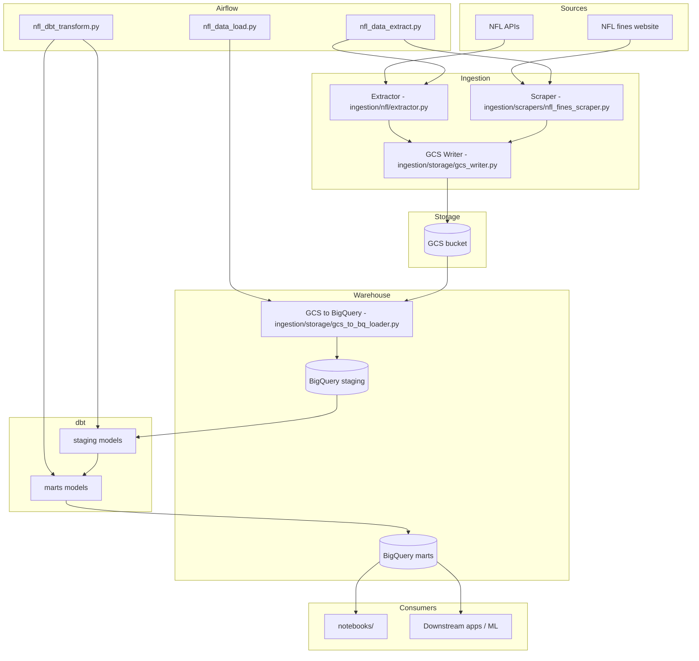

## Data Pipeline Architecture

Sanity check (should render a single arrow):

To view this diagram:
- Open `docs/architecture_diagram.md` in Cursor (it should render Mermaid).
- Or paste the code block into the Mermaid Live Editor (`https://mermaid.live`).
